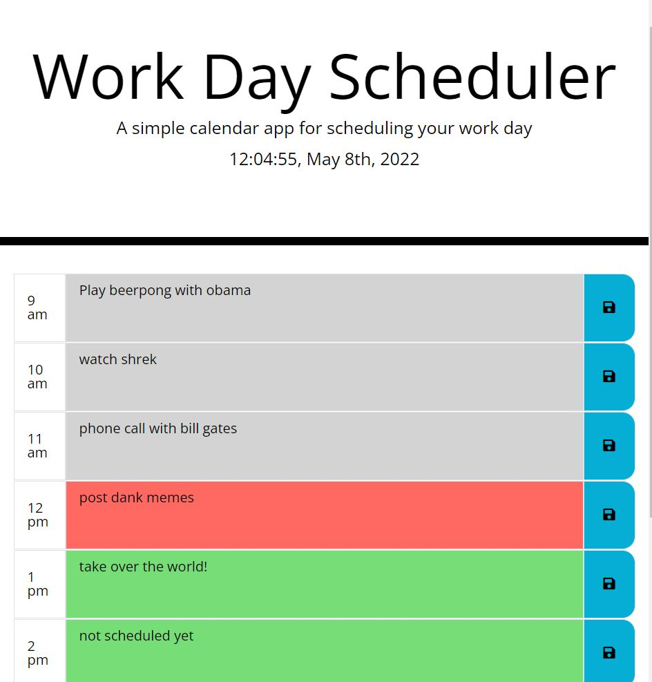

# Workday-Schedule-Planner

Workday-Schedule-Planner

This app allows the user to plan and save events at different time slots of a normal word day (9am-5pm)

It takes the current time using moment.js and colors the time slot depending if it already happened (grey), if it is currently happening (red) or if it hasn't happened yet(green).

Here's a demo screenshot of my schedule at 12pm

